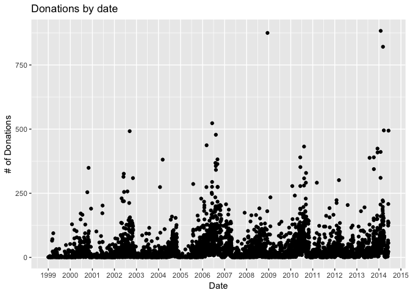
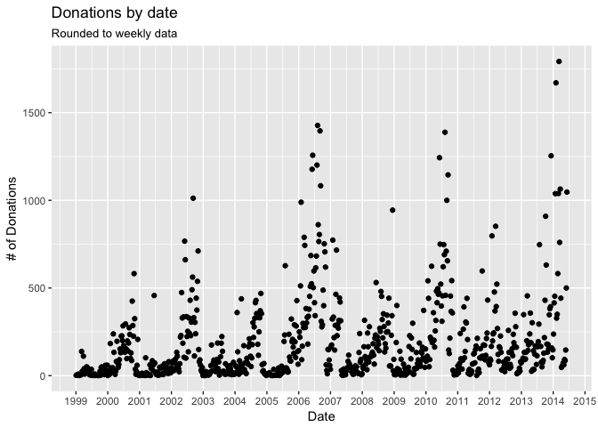
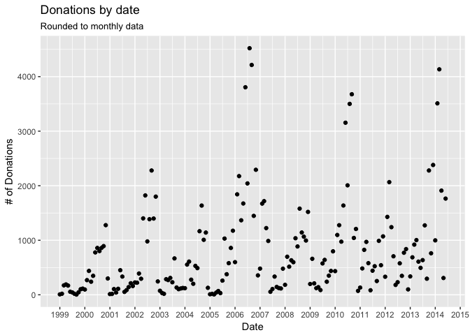
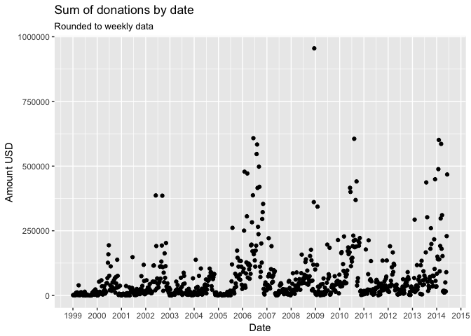
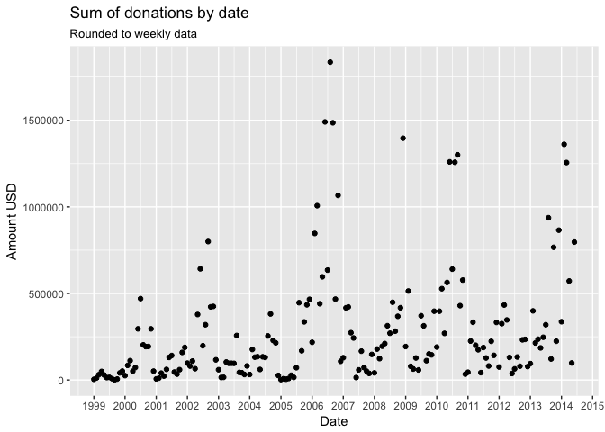

# Campaign Finance Exploration
Chris Hua  
17 December 2017  


## Motivation

Campaign finance is a well studied and deeply interesting area of politics. This writeup explores some campaign donations from Washington DC.

## The Data

Just a few rows


```r
qry <- data.world::qry_sql(
    "SELECT * FROM contributions LIMIT 5"
)
data.world::query(qry, DATA_SRC) %>% knitr::kable()
```


committee_name             candidate_name    contributor          address                          city         state   zip     contributor_type   contribution_type   employer_name   employer_address    amount  date_of_receipt 
-------------------------  ----------------  -------------------  -------------------------------  -----------  ------  ------  -----------------  ------------------  --------------  -----------------  -------  ----------------
Lillian for School Board   Lillian Perdomo   Keyerleher, Joseph   n/a                              Washington   DC      00000   Individual         Check               NA              Washington, DC          20  2008-10-26      
Lillian for School Board   Lillian Perdomo   Lemonon, Patrick     1827 Ingleside Ter., NW.         Washington   DC      20010   Individual         Check               NA              Washington, DC         100  2008-10-18      
Lillian for School Board   Lillian Perdomo   Lipez, Abel          2828 Connecticut Ave., NW.#414   Washington   DC      20008   Individual         Check               NA              Washington, DC         100  2008-10-21      
Lillian for School Board   Lillian Perdomo   Byrne, Betty         1822 Ingleside Ter., NW.         Washington   DC      20010   Individual         Check               NA              Washington, DC          50  2008-10-11      
Lillian for School Board   Lillian Perdomo   Marin, Carolina      1841 Columbia Rd. NW. Apt. 614   Washington   DC      20009   Individual         Check               NA              Washington, DC          80  2008-10-25      

### Number of donations by time

Next, we want to see if there's any interesting trends in the donation dates and aggregated amounts. We can pull this data with the following SQL code:


```r
date_qry <- data.world::qry_sql("SELECT 
    date_of_receipt     AS dt
    , COUNT(*)          AS n_donations
    , SUM(amount)       AS sum_donations
    FROM contributions
    GROUP BY dt
    ORDER BY dt")
date_df <- data.world::query(date_qry, DATA_SRC)
```

At a date granularity, we can kind of see some trends in the data, but it's really noisy. 

We can plot the donations, with one point per day.


```r
date_df %>%
    ggplot(aes(x = dt, y = n_donations)) +
    geom_point() + 
    ggtitle("Donations by date") + 
    ylab("# of Donations") + 
    xlab("Date")+
    scale_x_date(date_breaks = "1 years", date_labels = "%Y")
```

<!-- -->

Let's group the donations by week instead. This looks much cleaner!


```r
date_df %>%
    group_by(dt = lubridate::round_date(dt, unit = "week")) %>%
    summarize(n_donations = sum(n_donations),
              amount = sum(sum_donations)) %>%
    ggplot(aes(x = dt, y = n_donations)) + 
    geom_point() +
    ggtitle("Donations by date", "Rounded to weekly data") + 
    ylab("# of Donations") + 
    xlab("Date")+
    scale_x_date(date_breaks = "1 years", date_labels = "%Y")
```

<!-- -->

Finally, let's group them by month and visualize the results. When working with data, we often have to trade off human interpretability for robustness. 


```r
date_df %>%
    group_by(dt = lubridate::round_date(dt, unit = "month")) %>%
    summarize(n_donations = sum(n_donations),
              amount = sum(sum_donations)) %>%
    ggplot(aes(x = dt, y = n_donations)) + 
    geom_point() +
    ggtitle("Donations by date", "Rounded to monthly data") + 
    ylab("# of Donations") + 
    xlab("Date") +
    scale_x_date(date_breaks = "1 years", date_labels = "%Y")
```

<!-- -->

### Amount of donations by time


```r
date_df %>%
    group_by(dt = lubridate::round_date(dt, unit = "week")) %>%
    summarize(n_donations = sum(n_donations),
              amount = sum(sum_donations)) %>%
    ggplot(aes(x = dt, y = amount)) + 
    geom_point() +
    ggtitle("Sum of donations by date", "Rounded to weekly data") + 
    ylab("Amount USD") + 
    xlab("Date")+
    scale_x_date(date_breaks = "1 years", date_labels = "%Y")
```

<!-- -->


```r
date_df %>%
    group_by(dt = lubridate::round_date(dt, unit = "month")) %>%
    summarize(n_donations = sum(n_donations),
              amount = sum(sum_donations)) %>%
    ggplot(aes(x = dt, y = amount)) + 
    geom_point() +
    ggtitle("Sum of donations by date", "Rounded to weekly data") + 
    ylab("Amount USD") + 
    xlab("Date")+
    scale_x_date(date_breaks = "1 years", date_labels = "%Y")
```

<!-- -->

### Campaign level data

We can easily pull some campaign level data to figure out which campaigns raised the most money and garnered the most engagement.


```r
cmp_qry <- data.world::qry_sql("SELECT 
    committee_name      AS campaign
    , date_of_receipt   AS dt
    , COUNT(*)          AS n_donations
    , SUM(amount)       AS sum_donations
    FROM contributions
    GROUP BY campaign, dt
    ORDER BY campaign, dt")
cmp_df <- data.world::query(cmp_qry, DATA_SRC)
```


```r
cmp_df %>%
    group_by(campaign, dt = lubridate::round_date(dt, "year")) %>%
    summarize(n_donations = sum(n_donations), 
              sum_donations = sum(sum_donations)) %>%
    arrange(-n_donations) %>%
    head(10)
```

```
## # A tibble: 10 x 4
## # Groups:   campaign [7]
##                               campaign         dt n_donations
##                                  <chr>     <date>       <int>
##  1                      Gray for Mayor 2011-01-01        4860
##  2                          Fenty 2006 2006-01-01        4469
##  3                          Fenty 2006 2007-01-01        3654
##  4             Muriel Bowser for Mayor 2014-01-01        3619
##  5                          Fenty 2010 2010-01-01        2907
##  6 Citizens to Elect Linda Cropp Mayor 2006-01-01        2868
##  7               Tommy Wells for Mayor 2014-01-01        2845
##  8                          Fenty 2010 2009-01-01        2747
##  9                     Evans for Mayor 2014-01-01        2293
## 10                      Gray for Mayor 2010-01-01        2162
## # ... with 1 more variables: sum_donations <dbl>
```


```r
cmp_df %>%
    group_by(campaign, dt = lubridate::round_date(dt, "year")) %>%
    summarize(n_donations = sum(n_donations), 
              sum_donations = sum(sum_donations)) %>%
    arrange(-sum_donations) %>% 
    head(10)
```

```
## # A tibble: 10 x 4
## # Groups:   campaign [8]
##                               campaign         dt n_donations
##                                  <chr>     <date>       <int>
##  1                          Fenty 2010 2009-01-01        2747
##  2                      Gray for Mayor 2011-01-01        4860
##  3                          Fenty 2006 2007-01-01        3654
##  4             Muriel Bowser for Mayor 2014-01-01        3619
##  5                          Fenty 2010 2010-01-01        2907
##  6 Citizens to Elect Linda Cropp Mayor 2006-01-01        2868
##  7                          Fenty 2006 2006-01-01        4469
##  8                     Evans for Mayor 2014-01-01        2293
##  9                     Vince Gray 2014 2014-01-01        1928
## 10 Committee to Re-Elect Tony Williams 2003-01-01        2132
## # ... with 1 more variables: sum_donations <dbl>
```
